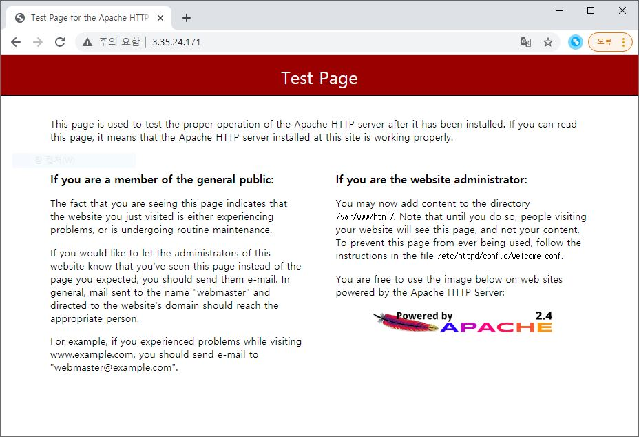

## A1 Instance 추천 

1개의 Public Nginx 와 1개의 Private httpd 설치 

### root로 변경 
```
sudo bash
```

###
```
amazon-linux-extras install -y nginx1.12 
```
### nginx 시작 
```
systemctl start nginx 
```
### 설치된 nginx 확인 
```
curl localhost 
```

### nginx conf 편집
```
vi /etc/nginx/nginx.conf 
```

```
location / {
           }
```

#### EC2 private IP 수정 - 

```
location / {
                proxy_pass http://10.10.3.252:80;                                                                               
           }
```

#### nginx 환경설정 다시 설정
```
nginx -s reload 
```

#### private httpd 설치 

#### 공인 IP로 접속할 경우 http 로 연결



